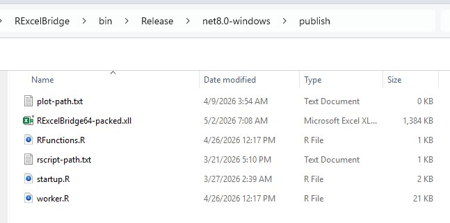

# ExcelBridgeSuite Installation Guide

ExcelBridgeSuite provides three Excel add-ins:

- RExcelBridge (R integration)  
- JuliaExcelBridge (Julia integration)  
- PythonExcelBridge (Python integration)  

You can install any or all of them using one of the methods below.

---

## Installation Options

### Option 1: Use Precompiled Add-ins (Recommended)

Download the precompiled add-in and load it directly into Excel using the steps below.  
This is the fastest way to get started.

---

### Option 2: Build from Source (Visual Studio)

If you prefer, you can build the add-in yourself from source.

The full project is available in this repository and can be opened in Visual Studio.  
Visual Studio Community Edition is free and can be downloaded from Microsoft.

Steps:
1. Install Visual Studio (Community Edition is sufficient)  
2. Clone or download this repository  
3. Open the solution file in Visual Studio  
4. Build the project (Release configuration)  
5. Navigate to the publish folder:  
   `RExcelBridge/bin/Release/net8.0-windows/publish`  
6. Load the generated `.xll` file into Excel (see instructions below)  

Building from source provides full visibility into the code and allows you to modify or extend the add-in if needed.

---

## Option 1: Install Precompiled Add-ins (Recommended)

1. Go to the Releases section of this repository  
2. Download the latest release  
3. Extract the contents to a local folder  

Each bridge (R, Julia, Python) includes a `publish` folder containing all required files.

---

## Publish Folder Structure (Important)

Each bridge has a folder like:

RExcelBridge\bin\Release\net8.0-windows\publish  

This folder contains everything needed to run the add-in.

After building or downloading the release, the `publish` folder will contain the files required to run the add-in.

## Publish Directory Contents

A typical publish directory contains the following files:

- `RExcelBridge64-packed.xll`  
  The Excel add-in. This is the file you load into Excel.

- `worker.R`, `startup.R`  
  R scripts used internally by the bridge to execute and manage R sessions.

- `RFunctions.R`  
  Optional helper functions that can be sourced into the R session.

- `rscript-path.txt`  
  Configuration file used to specify the path to `Rscript.exe`.

- `plot-path.txt`  
  Optional configuration file for controlling where plots are saved.

All files must remain together in this folder.  
Do not move or copy only the `.xll` file.
---

## rscript-path.txt (Required for RExcelBridge)

This file tells the add-in where to find `Rscript.exe`.

### Setup

## Load the Excel Add-in

1. Open Excel  
2. Click **File**  
3. Click **Options**  
4. In the Excel Options window, click **Add-ins**  
5. At the bottom, in the **Manage** dropdown, select **Excel Add-ins** and click **Go**  
6. In the Add-ins window, click **Browse**  
7. Navigate to your publish directory:  
   `RExcelBridge/bin/Release/net8.0-windows/publish`  
8. Select the file:  
   `RExcelBridge64-packed.xll`  
9. Click **OK**  

The add-in should now be loaded and available in Excel.

---

## Trust and Security Settings (Required for .xll Add-ins)

If Excel blocks the add-in or it does not load, follow one of the options below:

### Option 1: Unblock the file (recommended)

1. Close Excel  
2. In File Explorer, go to your publish folder  
3. Right-click `RExcelBridge64-packed.xll`  
4. Click **Properties**  
5. At the bottom, if you see a security message, check **Unblock**  
6. Click **Apply**, then **OK**  

---

### Option 2: Add the folder as a trusted location

1. Open Excel  
2. Click **File**  
3. Click **Options**  
4. Go to **Trust Center**  
5. Click **Trust Center Settings**  
6. Click **Trusted Locations**  
7. Click **Add new location**  
8. Browse to your publish folder:  
   `RExcelBridge/bin/Release/net8.0-windows/publish`  
9. Click **OK**  

---

### Option 3: Enable add-ins if disabled

1. Go to **File → Options → Add-ins**  
2. In **Manage**, select **Disabled Items** → click **Go**  
3. If the add-in appears, enable it  

---

After completing one of the above:

- Restart Excel  
- Re-load the add-in if needed (via **Browse**)  

---

**Note:**  
For broader distribution, consider digitally signing the `.xll` so users do not need to adjust security settings.

See the Usage section for:

- Running code from Excel  
- Passing data between Excel and R, Julia, and Python  
- Generating plots  
- Using bridge functions  

