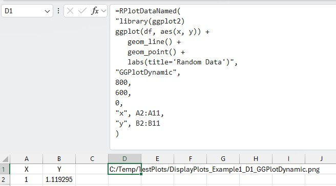
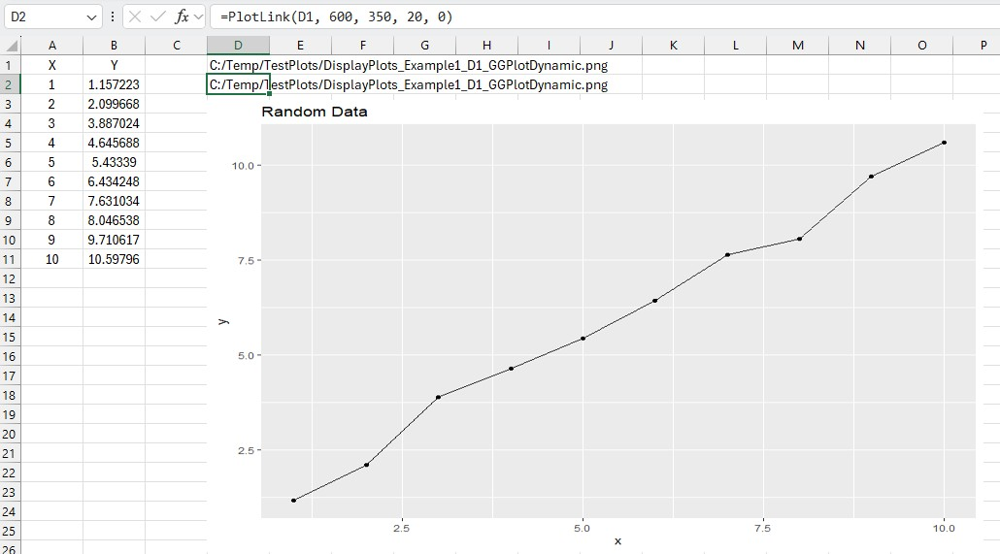

# RExcelBridge Usage Guide

This guide explains how to use RExcelBridge, the R-based add-in in ExcelBridgeSuite.

RExcelBridge is the reference implementation of the bridge pattern:
Excel → Add-in → R → Add-in → Excel

If you understand this workflow, the Julia and Python bridges will follow naturally.

---

## Quick Start

### Step 1 — Check connectivity

=RPing()

Expected:
OK | R version ...

---

### Step 2 — Evaluate a simple expression

=REval("1+1")

Expected:
2

---

### Step 3 — Return multiple values

=REval("c(10,20,30)")

---

If these steps work, you are ready to continue.

---

## Before You Start

- Add-in is attached and checked  
- rscript-path.txt points to Rscript.exe  
- Files remain in publish folder  

---

## Core Workflow

### Evaluate R code

=REval("sqrt(16)")

---

### Call an R function

=RCall("sum",1,2,3)

---

### Return structured data

=REval("matrix(c(1,2,3,4), nrow=2)")

---

### Pass data from Excel to R

=RSet("x", A1:B3)

=RGet("x")

---

## Custom Functions

Place in RFunctions.R

Example:

add_ten <- function(x) {
  x + 10
}

=REval("add_ten(5)")

---

## Numerical Example — Cholesky

=RCall("CholDecomp", A1:B2)

---

## Plotting

### Simple plot

=RPlot("plot(1:5, c(0,1,4,9,16), type='b')", "BasicPlot", 800, 600)

---

### Dynamic Plot (recommended)

Use two cells:

- RPlotDataNamed (creates plot)
- PlotLink (displays image)

---

## Performance (Large Data)

See:
[Performance Guide](PERFORMANCE.md)

---

## Troubleshooting

Ping fails → reload add-in  
R fails → check rscript-path.txt  
Plot fails → check plot-path.txt  

---

## Function Reference

RPing()
REval(code)
RCall(fun,...)
RSet(name,value)
RGet(name)
RPlot(...)
RSource(file)
RObjects()
RDescribe(name)
