# RExcelBridge Usage Guide

This guide explains how to use RExcelBridge, the R-based add-in in ExcelBridgeSuite.

RExcelBridge is documented first because it is the primary working example in the suite. It provides the clearest reference implementation for how the bridges are intended to work: how Excel calls into a language runtime, how values are passed back and forth, how user-defined wrapper functions are organized, and how plots are generated.

JuliaExcelBridge and PythonExcelBridge follow the same general design, but they are documented separately in their own directories.

If you understand the RExcelBridge workflow first, the Julia and Python bridges will be much easier to use.
---

## Where to Put Your R Functions

Custom R functions that you want to call from Excel should be placed in `RFunctions.R`.

This file is intended for user-defined wrappers, helper functions, and reusable logic. In general:

- `startup.R` is for startup behavior  
- `worker.R` is for bridge execution logic  
- `RFunctions.R` is for your custom Excel-callable R functions  

## Before You Start

Make sure:

- The add-in is attached in Excel  
- The add-in is checked under Excel Add-ins  
- For RExcelBridge, rscript-path.txt points to a valid Rscript.exe  
- All files remain together in the publish folder  

---

## 1. Start with RPing

The first thing to test is RPing().

### Purpose

Ping() is a connectivity and environment check. It confirms that:

- Excel has loaded the add-in  
- The bridge is responding  
- R is accessible  
- You are running the expected version  

### Example

=RPing()

### Expected Result

You should see something like:

OK | R version 4.5.3 (2026-03-11 ucrt)

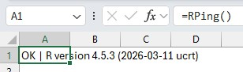

### What it means

- OK means the add-in is loaded and responding  
- The R version confirms that R is found and executable  
- The version string confirms your runtime environment  

This verifies the full pipeline:

Excel → Add-in → R → Add-in → Excel  

### If it fails

- Check the add-in is attached and checked  
- Restart Excel and reload the .xll  
- Verify rscript-path.txt  
- Confirm Rscript.exe runs from command line  

---

## 2. Evaluate a Simple Expression

Test that R can execute code.

Example:

=REval("1+1")


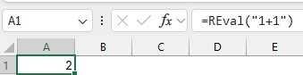

Expected result:

2

Another example:

=REval("sqrt(16)")

Expected result:

4

Get the current R working directory

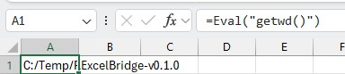

---

## 3. Return a Vector

Test returning multiple values.

Example:

=REval("c(10,20,30)")

Expected:

Values returned to Excel. These may spill across multiple cells depending on how the bridge returns arrays.

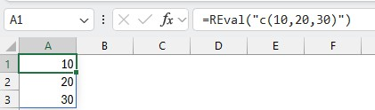

---

## 4. Return a Matrix

Test 2D data handling.

Example:

=REval("matrix(c(1,2,3,4), nrow=2)")

Expected:

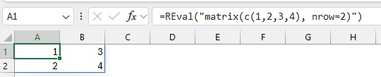

A 2 × 2 result returned to Excel.

---

## 5. Pass Data from Excel to R

This allows Excel to act as a front end.

Example data in Excel (A1:B3):

1   2  
3   4  
5   6  

Example workflow:

=RSet("x", A1:B3)  

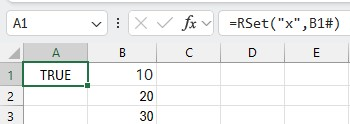

=REval("x")
=RGet("x")

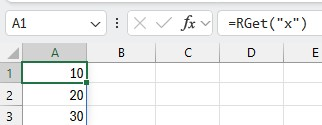

---

## 6. Create a Simple R Wrapper

Define reusable logic in R.

User-defined functions should be added to `RFunctions.R`.

This file is intended to hold custom R functions that you want to call from Excel. Keeping user functions in `RFunctions.R` makes them easier to find, maintain, and extend.

Example in `RFunctions.R`:

add_ten <- function(x) {  
  x + 10  
}

Call from Excel:

=REval("add_ten(5)")

Expected result:

15

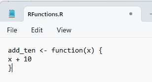

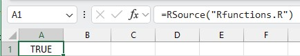

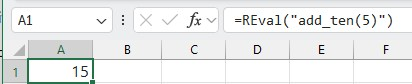

---

## 7. Cholesky Decomposition (Advanced Example)

This demonstrates real numerical computation.

### R Wrapper

Add the wrapper to `RFunctions.R`:

chol_decomp <- function(x, tol = 1e-8) {  
  x <- as.matrix(x)  
  
  if (!is.numeric(x)) {  
    stop("Input must be numeric.")  
  }  
  
  if (nrow(x) != ncol(x)) {  
    stop("Input matrix must be square.")  
  }  
  
  if (max(abs(x - t(x))) > tol) {  
    stop("Input matrix must be symmetric.")  
  }  
  
  chol(x)  
}

### Excel Example

### Requirements
- Matrix must be square
- Matrix must be symmetric
- Matrix must be positive definite

Put this matrix in Excel:

```
4   2
2   3
```

Then run:

```excel
=RCall("CholDecomp", A1:B2)
```

Expected result:

```
2        1
0   1.414214
```
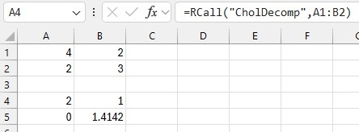

## Using Excel LAMBDA with RCall

You can wrap an `RCall` into an Excel LAMBDA function to make it reusable and easier to read.

### Inline example

```excel
=LAMBDA(matrix, RCall("CholDecomp", matrix))(A1:B2)
```
This defines a temporary function that takes a range (`matrix`) and passes it to the R function `CholDecomp`.

### Why use LAMBDA

- Cleaner formulas (avoids repeating `RCall(...)` everywhere)
- Reusable logic across the workbook
- Can be saved as a named function (e.g., `CholDecomp`)
- Provides a place to add validation (e.g., ensure matrix is square)

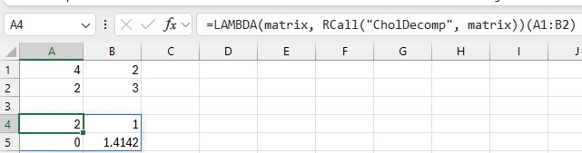

### Named function (recommended)

Define in Excel Name Manager:

```excel
CholDecomp = LAMBDA(matrix, RCall("CholDecomp", matrix))
```
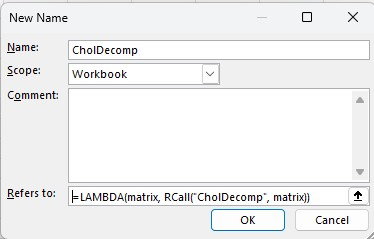

Then use it like a native Excel function:

```excel
=CholDecomp(A1:B2)
```
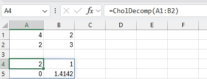

---

## 8. Plotting

Test graphical output.

Example:

=RPlot("plot(1:10)")

or:

=RPlotTest()

### What happens

1. R creates a PNG file  
2. The file is saved to disk  
3. The bridge returns or inserts the plot into Excel  

---

## 9. plot-path.txt Behavior

Controls where plots are saved.

If a path is provided, for example:

C:\Users\YourName\Documents\RExcelBridge\Plots

- Plots are written to this folder  
- The folder will be created if needed  

If plot-path.txt is empty or missing:

- A default location is used  
- Typically a Documents folder or a temporary directory  

For consistent results, it is recommended to set this explicitly.

---

## 10. Example Plot Wrapper in R

## Example 1 — Insert Plot Using Add-in Menu

This is the simplest way to create a plot.

### Steps

1. Enter data in Excel:

```
A B
X Y
1 0
2 1
3 4
4 9
5 16
```

2. In a cell, enter:

```excel
=RPlot("plot(1:5, c(0,1,4,9,16), type='b')", "BasicPlot", 800, 600)
```
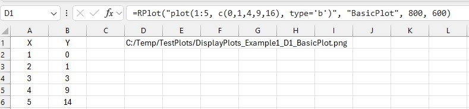

3. Use the ribbon:

RExcelBridge → Insert Plot From Selected Cell


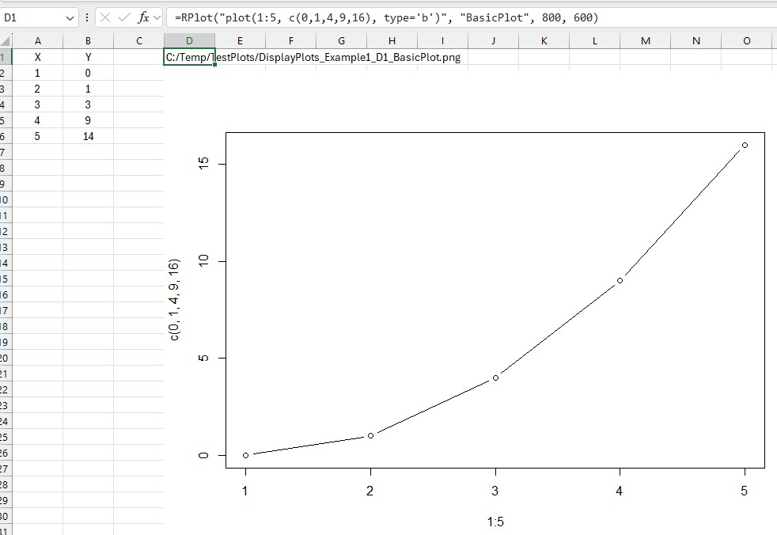

---

## 11. Suggested Workflow

Test in this order:

1. =Ping()  
2. =REval("1+1")  
3. Return a vector  
4. Return a matrix  
5. Pass Excel range to R  
6. Create wrapper function  
7. Run Cholesky example  
8. Generate a plot  

---

## 12. Troubleshooting

Ping fails  
- Add-in not loaded  
- Wrong .xll  
- Excel needs restart  

R execution fails  
- Check rscript-path.txt  
- Verify R installation  

Matrix issues  
- Ensure 2D shape is preserved  
- Ensure numeric input  

Cholesky fails  
- Matrix not symmetric  
- Matrix not positive definite  

Plot fails  
- Check plot-path.txt  
- Check folder permissions  
- Verify PNG file creation  

---

## Summary

Start with:

=Ping()

If you see:

OK | R version ...

you are ready to go.

From there, build up:

- simple expressions  
- data transfer  
- wrapper functions  
- numerical methods  
- plotting  

This progression ensures everything is working step by step.


# RExcelBridge user-visible functions

This file lists the Excel worksheet functions exposed to end users by the current `RExcelBridge` code.

## User-visible worksheet functions

### `RPing()`
Returns a simple response from the persistent R worker.

Example:
```excel
=RPing()
```

### `REval(code)`
Evaluates R code in the persistent R session.

Arguments:
- `code`: R code to evaluate.

Example:
```excel
=REval("1+1")
```

### `RPlot(code, plot_name, width, height)`
Renders an R plot to a PNG file and returns the file path.

Arguments:
- `code`: R plotting code or function call.
- `plot_name`: optional label used in the file name.
- `width`: PNG width in pixels.
- `height`: PNG height in pixels.

Example:
```excel
=RPlot("plot(1:10)","SimpleExpression",800,600)
```

### `RSource(file)`
Sources an R script file into the persistent R session.

Arguments:
- `file`: path to an R script file.

Example:
```excel
=RSource("D:/Projects/RExcelBridge/startup.R")
```

### `RCall(fun, arg1, arg2, arg3, arg4, arg5, arg6, arg7, arg8, arg9, arg10)`
Calls an R function with up to 10 arguments.

Arguments:
- `fun`: name of the R function.
- `arg1` to `arg10`: arguments passed to the function.

Example:
```excel
=RCall("sum",1,2,3)
```

### `RSet(name, value)`
Assigns an Excel value or range to an object in the persistent R session.

Arguments:
- `name`: name of the R object.
- `value`: Excel value, vector, or range.

Example:
```excel
=RSet("x",A1:A10)
```

### `RGet(name)`
Returns an object from the persistent R session to Excel.

Arguments:
- `name`: name of the R object.

Example:
```excel
=RGet("x")
```

### `RExists(name)`
Checks whether an object exists in the persistent R session.

Arguments:
- `name`: name of the R object.

Example:
```excel
=RExists("x")
```

### `RRemove(name)`
Removes an object from the persistent R session.

Arguments:
- `name`: name of the R object.

Example:
```excel
=RRemove("x")
```

### `RObjects()`
Lists objects in the persistent R session, including type and dimensions.

Example:
```excel
=RObjects()
```

### `RDescribe(name)`
Describes one object in the persistent R session.

Arguments:
- `name`: name of the R object.

Example:
```excel
=RDescribe("x")
```

### `RPlotTest()`
Creates a simple base R test plot and returns the PNG path.

Example:
```excel
=RPlotTest()
```

## Notes

- These are worksheet functions exposed with Excel-DNA `[ExcelFunction(...)]` attributes.
- Based on the code reviewed, `RPut` is **not** currently one of the exported user-visible functions.
- If you want `RPut` to exist, it would need to be added as another exported Excel function, or `RSet` could be renamed/aliased to `RPut`.
