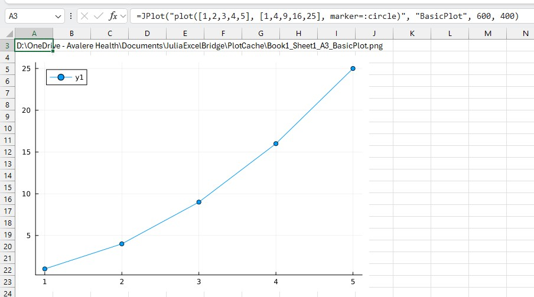

# JuliaExcelBridge Usage Guide

This guide explains how to use JuliaExcelBridge, the Julia-based add-in in ExcelBridgeSuite.

JuliaExcelBridge follows the bridge pattern:

```text
Excel → Add-in → Julia → Add-in → Excel
```

---

## Quick Start

### Step 1 — Check connectivity

```excel
=JPing()
```

Expected:

```text
OK | Julia version ...
```

---

### Step 2 — Evaluate a simple expression

```excel
=JEval("1+1")
```

Expected:

```text
2
```

---

### Step 3 — Return multiple values

```excel
=JEval("[10,20,30]")
```

---

## Validation

If the steps above work, your environment is correctly configured.

The following have been validated:

- The Excel add-in is loaded and active
- Julia is accessible from the configured executable
- The bridge is executing Julia code successfully

---

## Core Workflow

### Evaluate Julia code

```excel
=JEval("sqrt(16)")
```

Expected:

```text
4
```

---

### Create a Julia object

```excel
=JEval("x = [1 2; 3 4]")
```

---

### Return a Julia object

```excel
=JGet("x")
```

---

## Numerical Example — Cholesky Decomposition

Julia has built-in support for numerical linear algebra through the `LinearAlgebra` standard library.

### Requirements

- Matrix must be square
- Matrix should be symmetric
- Matrix must be positive definite

Put this matrix in Excel:

```text
4   2
2   3
```

### Step 1 — Load LinearAlgebra

```excel
=JEval("using LinearAlgebra")
```

### Step 2 — Store the matrix

```excel
=JSet("A", A1:B2)
```

### Step 3 — Run Cholesky

```excel
=JEval("cholesky(A).L")
```

Expected result:

```text
2        0
1   1.414214
```

Note:

Julia returns the lower triangular Cholesky factor when using `.L`.

---

## Simple Julia Plot

This example creates a Julia plot, saves it to the plot cache folder, and returns the PNG path to Excel.

This assumes Julia plotting is configured using `Plots.jl`.

### Step 1 — Load Plots

```excel
=JEval("using Plots")
```

### Step 2 — Create the Plot

```excel
=JPlot("plot([1,2,3,4,5], [1,4,9,16,25], marker=:circle)", "BasicPlot", 800, 600)
```

The formula should return a PNG file path similar to:

```text
D:\OneDrive - Avalere Health\Documents\JuliaExcelBridge\PlotCache\Book1_Sheet1_A4_BasicPlot.png
```

### Step 3 — Insert the Plot

Select the cell containing the PNG path and use either:

```text
Add-ins -> JuliaExcelBridge -> Insert Plot From Selected Cell
```

or:

```text
Ctrl + Shift + P
```
### Example Output


---

## Dynamic Julia Plot from Excel Data

This example uses worksheet data, Julia plotting, and the same `PlotLink()` VBA workflow used by the other bridges.

The workflow is:

```text
Excel worksheet data
    ↓
JPlotDataNamed()
    ↓
Julia generates PNG
    ↓
PlotLink() displays image
    ↓
Worksheet recalculation refreshes the plot
```

### 1. Worksheet Data

Create worksheet data in columns A and B.

```text
A1: X      B1: Y
A2: 1      B2: =A2+(RAND()-0.5)
A3: 2      B3: =A3+(RAND()-0.5)
A4: 3      B4: =A4+(RAND()-0.5)
...
A11: 10    B11: =A11+(RAND()-0.5)
```

Because the Y values use `RAND()`, the data changes every time Excel recalculates.

### 2. Create the Julia Plot

In cell `D1`, enter:

```excel
=JPlotDataNamed(
  "plot(X, Y, marker=:circle)",
  "BasicPlotData",
  800,
  600,
  "X", A2:A11,
  "Y", B2:B11
)
```

This formula reads Excel ranges into Julia, creates a plot, saves the PNG file, and returns the PNG path to Excel.

### 3. Display the Plot in Excel

In cell `D2`, enter:

```excel
=PlotLink(D1, 600, 400)
```

`PlotLink()` links the PNG path to a displayed image on the worksheet.

### 4. Import the VBA Plot Display Module

Import the VBA module:

```text
vba/DisplayImages.bas
```

This module provides the `PlotLink()` function and the image refresh logic.

It handles:

- detecting `=PlotLink(...)` formulas
- inserting plot images
- refreshing images after recalculation
- replacing outdated images automatically

### 5. Add the Worksheet Recalculation Event

In the worksheet VBA code page, add:

```vba
Private Sub Worksheet_Calculate()
    RefreshPlotLinksInSheet Me
End Sub
```

This event handler refreshes displayed plot images whenever the worksheet recalculates.

### 6. Refresh the Plot

Press:

```text
F9
```

Each recalculation changes the worksheet data, reruns the Julia plotting code, regenerates the PNG file, and refreshes the displayed plot image.

---

## Troubleshooting

Ping fails → reload add-in

Julia fails → check `julia-path.txt`

Plot fails → confirm `Plots.jl` is installed and Julia can save PNG files

If plotting packages are missing, install them in Julia:

```julia
using Pkg
Pkg.add("Plots")
```

---

## Function Reference

```text
JPing()
JEval(code)
JSet(name,value)
JGet(name)
JGetNumeric(name)
JPlot(...)
JPlotDataNamed(...)
```
