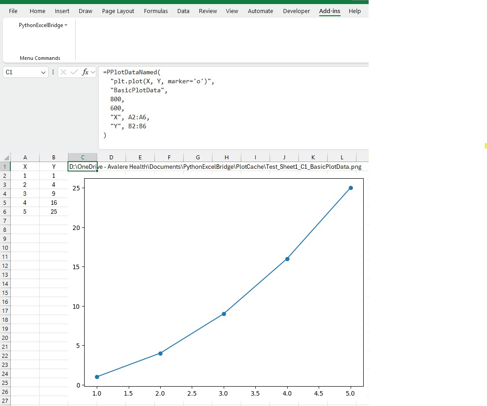

# PythonExcelBridge Usage Guide

This guide explains how to use PythonExcelBridge, the Python-based add-in in ExcelBridgeSuite.

PythonExcelBridge follows the bridge pattern:
Excel → Add-in → Python → Add-in → Excel

---

## Quick Start

### Step 1 — Check connectivity

=PPing()

Expected:
OK | Python version ...

---

### Step 2 — Evaluate a simple expression

=PEval("1+1")

Expected:
2

---

### Step 3 — Return multiple values

=PEval("[10,20,30]")

---

## Validation

If the steps above work, your environment is correctly configured.

The following have been validated:

- The Excel add-in is loaded and active  
- Python is accessible via the configured executable  
- The bridge is executing Python code successfully  

---

## Core Workflow

### Evaluate Python code

=PEval("16**0.5")

---

### Pass data from Excel to Python

=PSet("x", A1:B3)

=PGet("x")

---

## Fast Data Transfer

### Numeric matrices

=PSet("x", A1:D1000)

=PGetNumeric("x")

=PLastTransfer()

---

### Tables / DataFrames

=PSetTable("df", A1:D1000, TRUE)

=PGetTable("df")

=PLastTransfer()

---

### Large data example

=PSet("x", A1:Z10000)

=PGetNumeric("x")

=PLastTransfer()

---

## Python Examples

### Lambda Function

=PEval("(lambda x: x + 10)(5)")

Expected:
15

---

### List Comprehension

=PEval("[x*x for x in [1,2,3,4]]")

Expected:
1   4   9   16

---

### Call python function (create random matrix)

loads the NumPy library into the Python session and assigns it the alias np.

=PEval("import numpy as np")

Generate a 10000 × 26 random matrix:

=PCall("np.random.rand",10000,26)


### Cholesky Decomposition (NumPy)

### Requirements
- Matrix must be square
- Matrix should be symmetric
- Matrix must be positive definite

Put this matrix in Excel:

```
4   2
2   3
```

### Step 1 — load the NumPy librar

=PEval("import numpy as np")

### Step 2 — Run Cholesky

=PCall("np.linalg.cholesky",A1:B2)

Expected result:

```
2        0
1   1.414214
```

Note:
NumPy returns a **lower triangular matrix**, which differs from R's upper triangular result.

## Simple Python Plot

The example below creates a matplotlib plot, saves it to the plot cache folder, and returns the PNG path to Excel.

### Excel Formula

```excel
=PPlot("plt.plot([1,2,3,4,5], [1,4,9,16,25], marker='o')", "BasicPlot", 800, 600)
```

### Result

The formula returns a PNG file path similar to:

```text
D:\OneDrive - Avalere Health\Documents\PythonExcelBridge\PlotCache\Book1_Sheet1_A4_BasicPlot.png
```

Select the cell containing the PNG path and use either:

```text
Add-ins -> PythonExcelBridge -> Insert Plot From Selected Cell
```

or:

```text
Ctrl + Shift + P
```

### Example Output



## Troubleshooting

Ping fails → reload add-in  
Python fails → check python-path.txt  

---

## Function Reference
```
PPing()
PEval(code)
PSet(name,value)
PGet(name)
PSetTable(name,value,hasHeaders)
PGetTable(name)
PGetNumeric(name)
PLastTransfer()
```
